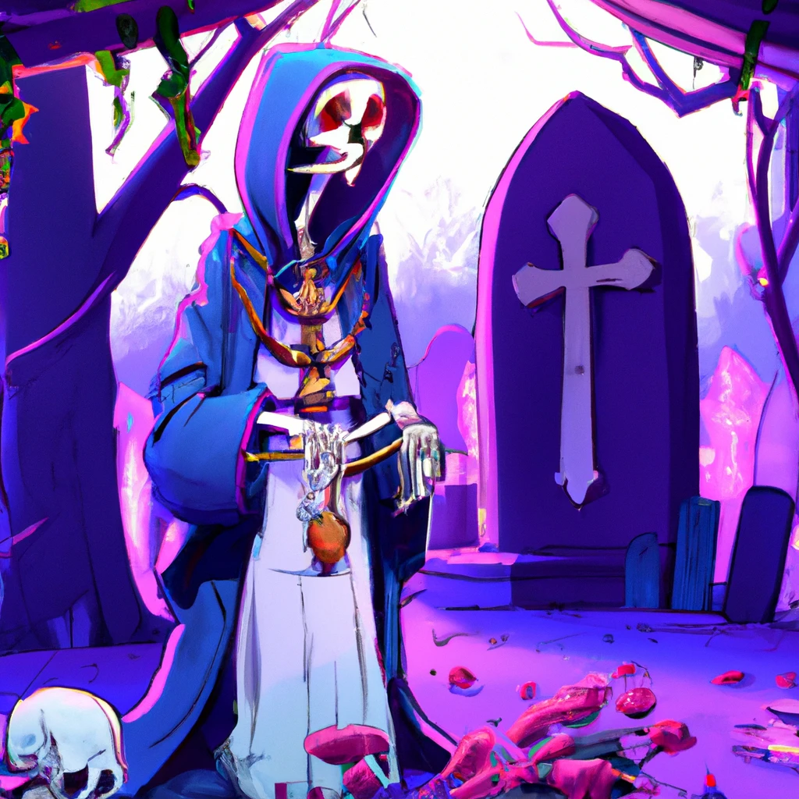

# [Caballero](Caballero.md)



## description

## relationships

Currently has the following creatures under his wing:

- [Karel](../Creatures/Karel.md)

## facts

- [ ] When revived, starts again at lvl 1

## references

```dataview
TABLE file.cday as Created
FROM "DND/Example campaign" where file.name != this.file.name AND contains(file.outlinks.file.name, this.file.name)
SORT file.cday DESC
```
